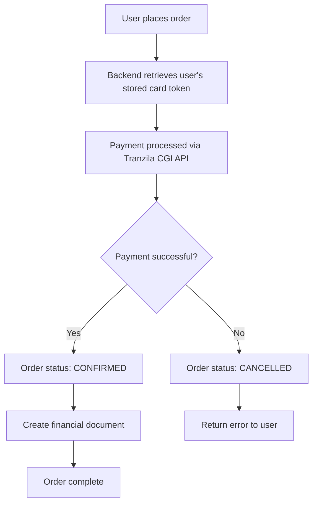

# Tranzila Payment Gateway Integration

This document describes the complete Tranzila payment gateway integration implemented in the Magic Store application.

## Overview

The integration provides:
- **Secure tokenization**: Credit cards are tokenized by Tranzila, no sensitive data is stored locally
- **PCI DSS compliance**: Token-based payments ensure compliance
- **Seamless checkout**: Users can add/update cards and complete purchases
- **Financial documents**: Automatic invoice/receipt generation
- **Multi-language support**: Hebrew interface support

## Architecture

### Backend Components

#### 1. Tranzila Module (`backend/api/src/tranzila/`)
- **TranzilaService**: Handles payment processing and document creation
- **TranzilaController**: API endpoints for tokenization and payment
- **Entities**: Database models for credit cards and documents

#### 2. Checkout Module (`backend/api/src/checkout/`)
- **CheckoutService**: Order processing with Tranzila integration
- **CheckoutController**: Order creation endpoints
- **DTOs**: Data transfer objects for checkout flow

### Frontend Components

#### 1. Checkout Page (`projects/storefront/src/app/checkout/`)
- **CheckoutPageComponent**: Main checkout flow with Tranzila integration
- **Payment Success/Failure Pages**: Handle tokenization results

#### 2. API Service
- **Tranzila methods**: Card management and tokenization URL generation

## Implementation Details

### 1. Card Tokenization Flow

```mermaid
graph TD
    A[User clicks "Add Credit Card"] --> B[Frontend requests tokenization URL]
    B --> C[Backend generates Tranzila URL with user ID]
    C --> D[User redirected to Tranzila hosted page]
    D --> E[User enters card details on Tranzila]
    E --> F[Tranzila processes card and generates token]
    F --> G[Tranzila sends server-to-server notification]
    G --> H[Backend stores token linked to user]
    H --> I[User redirected back to success page]
    I --> J[Frontend refreshes card status]
```

### 2. Payment Processing Flow



## Database Schema

### Credit Card Entity
```sql
CREATE TABLE credit_cards (
    id UUID PRIMARY KEY,
    user_id UUID REFERENCES users(id),
    token VARCHAR(255) NOT NULL,     -- Tranzila token (TranzilaTK)
    last_four VARCHAR(4),            -- Last 4 digits
    expdate VARCHAR(4),              -- MMYY format
    is_default BOOLEAN DEFAULT true,
    created_at TIMESTAMP DEFAULT NOW(),
    updated_at TIMESTAMP DEFAULT NOW()
);
```

### Tranzila Document Entity
```sql
CREATE TABLE tranzila_documents (
    id UUID PRIMARY KEY,
    order_id UUID REFERENCES orders(id),
    transaction_id VARCHAR(100),
    tranzila_document_id INTEGER NOT NULL,
    tranzila_document_number INTEGER NOT NULL,
    tranzila_retrieval_key VARCHAR(255) NOT NULL,
    metadata JSONB,
    created_at TIMESTAMP DEFAULT NOW()
);
```

### Order Entity Updates
```sql
-- Added fields to orders table
ALTER TABLE orders ADD COLUMN tranzila_transaction_id VARCHAR(100);
ALTER TABLE orders ADD COLUMN payment_error_message TEXT;
ALTER TABLE orders ADD COLUMN payment_status VARCHAR(20) DEFAULT 'pending';
```

## API Endpoints

### Tranzila Endpoints

#### POST `/api/tranzila/tokenization-url`
Generate secure tokenization URL for adding/updating credit cards.

**Headers**: Authorization Bearer token required

**Response**:
```json
{
  "tokenizationUrl": "https://direct.tranzila.com/terminal_name/iframenew.php?..."
}
```

**Security**: Uses secure iframe method without exposing credentials in URL.

#### GET `/api/tranzila/me/credit-card`
Get current user's stored credit card information (masked).

**Response**:
```json
{
  "lastFour": "1234",
  "expdate": "1225",
  "isDefault": true
}
```

#### POST `/api/tranzila/notify`
Server-to-server notification endpoint for tokenization (called by Tranzila).

#### POST `/api/tranzila/process-payment`
Process payment using stored token (internal use).

#### POST `/api/tranzila/create-document`
Create financial document (internal use).

### Checkout Endpoints

#### POST `/api/orders`
Create new order with Tranzila payment processing.

**Request**:
```json
{
  "storeSlug": "example-store",
  "cartItems": [
    {
      "productId": "uuid",
      "quantity": 2,
      "price": 29.99
    }
  ],
  "shippingAddress": {
    "firstName": "John",
    "lastName": "Doe",
    "address1": "123 Main St",
    "city": "Tel Aviv",
    "zipCode": "12345",
    "country": "Israel"
  },
  "billingAddress": { /* same structure */ },
  "shippingMethodId": "standard",
  "termsAccepted": true,
  "subtotal": 59.98,
  "shippingCost": 10.00,
  "taxAmount": 11.90,
  "total": 81.88
}
```

## Environment Configuration

Create a `.env` file in `backend/api/` with the following variables:

```bash
# Database Configuration
POSTGRES_HOST=localhost
POSTGRES_PORT=5432
POSTGRES_USER=postgres
POSTGRES_PASSWORD=password
POSTGRES_DB=magic_store

# Application Configuration
NODE_ENV=development
JWT_SECRET=your_jwt_secret_here
API_BASE_URL=http://localhost:3000
FRONTEND_URL=http://localhost:4200

# Tranzila Configuration (get from your Tranzila account)
TRANZILA_PUBLIC_KEY=your_tranzila_public_key_here
TRANZILA_PRIVATE_KEY=your_tranzila_private_key_here
TRANZILA_TERMINAL_NAME=your_terminal_name_here
TRANZILA_PW=your_tranzila_password_here
TRANZILA_PAYMENT_API_URL=https://secure5.tranzila.com/cgi-bin/tranzila71u.cgi
DEFAULT_VAT_PERCENT=17.0

# SECURITY NOTE: 
# - TRANZILA_PW is only used for server-to-server payment processing
# - It is NEVER exposed in URLs or client-side code
# - Tokenization uses secure iframe method without credentials in URL
```

## Frontend Integration

### User Experience Flow

1. **Checkout Page**: User fills shipping information
2. **Payment Step**: 
   - If no card: Show "Add Credit Card" button
   - If card exists: Show masked card details with option to update
3. **Card Addition**: Opens Tranzila popup for secure tokenization
4. **Order Review**: Shows masked card information
5. **Order Placement**: Uses stored token for payment

### Key Frontend Methods

```typescript
// Check if user has a credit card
checkCreditCardStatus(): Observable<{hasCard: boolean; cardInfo?: any}>

// Get Tranzila tokenization URL
getTranzilaTokenizationUrl(): Observable<{tokenizationUrl: string}>

// Add credit card (opens Tranzila popup)
addCreditCard(): void

// Place order with Tranzila payment
placeOrder(): void
```

## Security Features

### 1. Token-Based Security
- No credit card numbers stored in database
- Only Tranzila tokens and last 4 digits retained
- Tokens are meaningless outside Tranzila system

### 2. HTTPS Communication
- All API communications use HTTPS
- Tranzila iframe/popup uses secure connection

### 3. Authentication
- Billing API uses HMAC-SHA256 authentication
- User authentication required for all operations

### 4. Validation
- Comprehensive input validation on all endpoints
- Address and order data validation
- Transaction verification

## Testing

### 1. Tranzila Test Environment
- Use Tranzila sandbox/test credentials
- Test card tokenization flow
- Verify payment processing

### 2. Integration Testing
```bash
# Run backend tests
cd backend/api
npm test

# Test specific scenarios
npm run test:e2e
```

### 3. Frontend Testing
```bash
# Run frontend tests
cd projects/storefront
ng test

# E2E testing
ng e2e
```

## Deployment Checklist

### Backend Deployment
- [ ] Set production Tranzila credentials
- [ ] Configure HTTPS endpoints
- [ ] Set up database migrations
- [ ] Configure logging and monitoring
- [ ] Test payment processing in production

### Frontend Deployment
- [ ] Update API URLs for production
- [ ] Configure CDN for static assets
- [ ] Test checkout flow end-to-end
- [ ] Verify Tranzila popup functionality

## Troubleshooting

### Common Issues

#### 1. Tokenization Fails
- Check Tranzila credentials in environment
- Verify notify_url is accessible from Tranzila
- Check browser popup blockers

#### 2. Payment Processing Fails
- Verify stored token is valid
- Check network connectivity to Tranzila
- Review error logs for specific issues

#### 3. Document Creation Fails
- Ensure Billing API keys are configured
- Check VAT percentage configuration
- Verify terminal name is correct

### Debug Logs
Enable detailed logging in development:
```bash
NODE_ENV=development
LOG_LEVEL=debug
```

## Support

For technical issues:
1. Check application logs
2. Review Tranzila transaction logs
3. Contact Tranzila support for payment issues
4. Review this documentation for configuration

## Next Steps

Future enhancements could include:
- Multi-currency support
- Refund processing
- Subscription payments
- Enhanced fraud detection
- Mobile app integration 