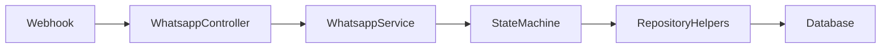

## 1. High-Level Overview

### Business Purpose
The WhatsApp bot allows store managers to manage their products, categories, and stock directly through WhatsApp. 
It solves the problem of needing to access a complex web interface, providing a fast and convenient solution for managing the store via phone.

### Main Features
- Add new products
- Manage product categories
- Check stock levels (new feature)

### End Users
Only authorized phone numbers can use the bot. Each store manager must be registered and verified in the system.

## 2. Architecture & Core Concepts

### Architecture Diagram



### Component Roles
- **Webhook:** Receives incoming WhatsApp messages.
- **WhatsappController:** Receives the message from the Webhook and forwards it to the Service.
- **WhatsappService:** Orchestrates the bot logic, interacts with the state machine, and sends responses back to the user.
- **State Machine:** Determines the user's current state and decides the next function to execute in the conversation.
- **Repository Helpers:** Helper functions to interact with the database without polluting state machine logic.
- **Database:** Stores the user's conversation state and temporary context data.

### State Machine

A **state machine** is a system that manages different stages of a conversation. It is ideal for conversational bots because it keeps track of the user's current step and what should happen next.

- **Tracking User State:** Stored in `ConversationStateEntity`:
  - `currentState`: indicates the current step in the conversation
  - `context`: stores temporary data related to the conversation

- **handleState Function:** 
  The `handleState` function in `state-machine.ts` receives the current state and calls the corresponding function to process the user's input.

- **Context Example (Add Product Flow):**
```json
{
  "productName": "My New T-Shirt",
  "category": "2",
  "price": "50"
}
