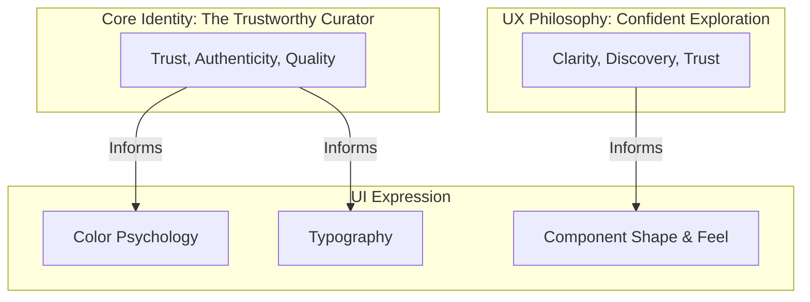

# Global Marketplace App: Brand & UX Strategy

This document establishes the strategic foundation for the Global Marketplace App. It is our guiding light for creating a cohesive, meaningful, and successful product.

## 1. Core Identity: "The Trustworthy Curator"

This is our brand's personality. We are a blend of **The Sage** (knowledgeable, trusted, a source of truth) and **The Everyman** (approachable, friendly, for everyone).

*   **Mission:** To connect the world's most talented artisans with a global audience, making the discovery of unique, authentic goods a simple and joyful experience.
*   **Vision:** To be the most trusted and beloved platform for handcrafted and unique products worldwide.
*   **Core Values:**
    *   **Trust:** Every feature, from product listings to payment, is built on a foundation of security and transparency.
    *   **Authenticity:** We celebrate the stories behind the products and the people who make them.
    *   **Quality:** We are a curated platform. Our brand stands for high-quality goods.
    *   **Simplicity:** We make global commerce feel effortless and intuitive.

## 2. UX Philosophy: "Confident & Effortless Exploration"

Our user experience will be guided by these core principles:

*   **Clarity Above All:** Users must always feel in control and informed. No jargon, no confusing paths, no ambiguity.
*   **Discovery, Not Searching:** While we have a search function, the primary experience should feel like a delightful journey of discovery, where users are guided to things they'll love.
*   **Build Trust at Every Step:** From clear store attribution on every product to a transparent and secure checkout, every interaction reinforces our core value of Trust.
*   **Global Scale, Personal Feel:** The app offers the world, but it feels like it was built just for *you* through personalization and thoughtful curation.

## 3. Brand Voice & Marketing Language

*   **Tone of Voice:** **Warm, knowledgeable, encouraging, and respectful.** We are a friendly guide, not a corporate machine. We are passionate about our sellers and their craft.
*   **Marketing Keywords:** Authentic, Handcrafted, Curated, Discover, Unique, Global, Story, Quality, Trusted.
*   **Visual Language (The "Feel"):**
    *   **Photography:** This is paramount. We need **high-quality, professional, and authentic lifestyle photography.** Show products in a real-world context. Showcase the artisans. Avoid sterile, white-background shots where possible.
    *   **Layouts:** **Clean, spacious, and grid-based.** Our layouts are the gallery walls; the products are the art. We use generous white space to let content breathe and reduce cognitive load.

## 4. UI Style Guide (Derived from Strategy)

This is the tangible expression of our brand identity and philosophy.

### 4.1. Color Psychology & Palette

*   **Primary (Deep Teal/Blue - `#0A4F70`):** Chosen for its deep association with **Trust, Wisdom, and Stability.** It is calming and professional.
*   **Accent (Warm Gold - `#FFC107`):** Represents **Quality, Value, and Optimism.** It’s the "sparkle" of a great find. Used for calls-to-action, sale pricing, and highlights.
*   **Neutrals (Off-White `#FFFFFF`, Light Gray `#F5F5F5`):** Creates a feeling of **Calm, Cleanliness, and Space.** This ensures our vibrant product photography is the hero.

### 4.2. Typography (Lato Font Family)

*   **Why Lato?** It was designed to feel "warm" and "stable." It's serious without being overbearing, friendly without being childish. It perfectly embodies our "Trustworthy Curator" personality.

### 4.3. Component Feel

*   **Shape:** Components like cards and buttons will have a subtle **border radius (8-12px)**. This feels more organic, friendly, and less severe than sharp corners.
*   **Elevation:** We will use **subtle, soft shadows** to create a sense of depth and tangibility. It makes UI elements feel premium and well-crafted, just like the products we sell.
*   **Iconography (Material Symbols - Outlined):** Outlined icons are lighter and less visually demanding than filled ones, contributing to the clean, uncluttered, and sophisticated feel.